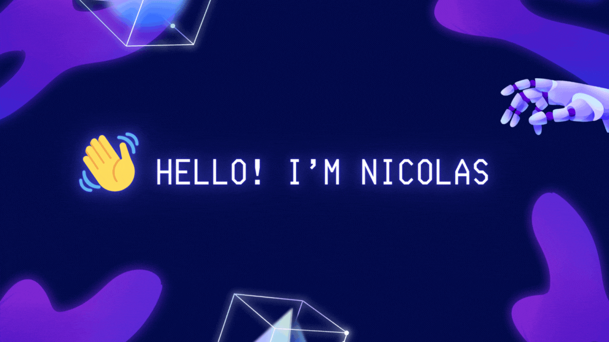

# 👋 Hello! I'm Nicolas Calderon

## 

### 🚀 Full-Stack Developer | Cloud Solutions Architect | AI Enthusiast

Welcome to my GitHub profile! I'm a passionate and versatile Software Engineer from Bogotá, Colombia, dedicated to exploring and implementing cutting-edge technologies. With a solid foundation in full-stack development and backend engineering, I strive to deliver optimized and meaningful solutions that not only meet but exceed expectations.

## 📝 **About Me**

I'm deeply interested in leveraging AI technologies to create intelligent applications that streamline processes and contribute to overall business growth. My career is driven by a passion for precision, continuous learning, and delivering exceptional outcomes for both users and businesses.

## 💡 **What I Do Best**

- **🔗 Full-Stack Development:**  
  I develop dynamic web and mobile applications using React, React Native, Angular, Next.js, TypeScript, Tailwind, Java, and Spring Boot. I focus on creating optimized and scalable solutions that enhance user experiences.

- **🛠️ Backend Engineering:**  
  Expert in designing and maintaining robust server-side applications. I have extensive experience in API development, database management, and scalable microservices architectures using Spring Boot and Node.js.

- **☁️ Cloud Solutions:**  
  Proficient in deploying and managing applications on AWS and Azure. I ensure optimal cloud integration and leverage advanced cloud-native tools to achieve peak performance and scalability.

- **📈 Software Engineering & Project Management:**  
  Adept at driving projects from concept to deployment using agile methodologies, ensuring efficient delivery, process optimization, and alignment with business objectives.

- **🎯 Problem-Solving & Customer Focus:**  
  Committed to resolving complex challenges with innovative solutions that prioritize client satisfaction, consistently exceeding expectations to drive success.

- **🧠 AI Technology Integration:**  
  Passionate about using AI technologies to create intelligent systems and applications that unlock new possibilities and contribute to business success.

## 🌐 **Connect with Me**
- [LinkedIn](https://www.linkedin.com/in/nicolas-calderon/)
- [Personal Portfolio](#) *(Link to your portfolio or website)*

