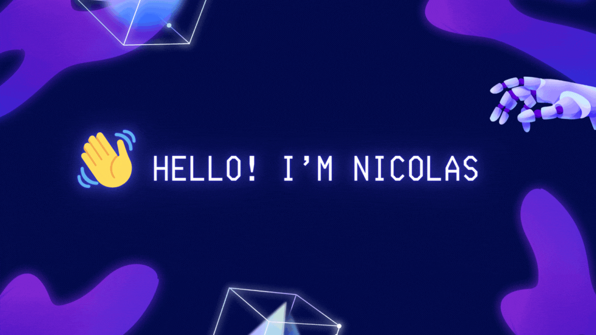

# 👋 Hello! I'm Nicolas Calderon

 

 ## 🌐 Connect with Me

## 🚀 Full-Stack Developer | Cloud Solutions Architect | AI Enthusiast
Welcome to my GitHub profile! I'm Nicolas, a passionate and versatile Software Engineer from Bogotá, Colombia, dedicated to exploring and implementing cutting-edge technologies. With a solid foundation in full-stack development and backend engineering, I strive to deliver optimized and meaningful solutions that not only meet but exceed expectations.

## 🖥️ Tech

### Lenguages
  
  
  
  
  
  
  
  
  
  <!-- Frameworks -->
### Frameworks
  
  
  
  
  
  
  
  
  
  

### Storages
  
  
  
  
  
  

### Tools
  
  
  
  
  
  
  
  
  
  
  

### Cloud Tools
  
  
  
  

## 📝 About Me

I am an enthusiastic and detail-oriented Software Engineer from Bogotá, Colombia, with a diverse background in full-stack development, backend engineering, and AI integration. My journey is fueled by a relentless pursuit of innovation and excellence in every project I undertake. 

With a passion for cloud-based solutions, I’m dedicated to pushing the boundaries of what technology can achieve. I thrive in environments that demand creativity, problem-solving, and a keen understanding of both software engineering principles and business objectives.

In addition to technical expertise, I bring a strong focus on collaboration, clear communication, and agile project management, ensuring that each solution not only meets expectations but also drives business success and enhances user experiences.

## 💡 What I Do Best

- **🔗 Full-Stack Development:**  
  I develop dynamic web and mobile applications using React, React Native, Angular, Next.js, TypeScript, Tailwind, Java, and Spring Boot. I focus on creating optimized and scalable solutions that enhance user experiences.

- **🛠️ Backend Engineering:**  
  Expert in designing and maintaining robust server-side applications. I have extensive experience in API development, database management, and scalable microservices architectures using Spring Boot and Node.js.

- **☁️ Cloud Solutions:**  
  Proficient in deploying and managing applications on AWS and Azure. I ensure optimal cloud integration and leverage advanced cloud-native tools to achieve peak performance and scalability.

- **📈 Software Engineering & Project Management:**  
  Adept at driving projects from concept to deployment using agile methodologies, ensuring efficient delivery, process optimization, and alignment with business objectives.

- **🎯 Problem-Solving & Customer Focus:**  
  Committed to resolving complex challenges with innovative solutions that prioritize client satisfaction, consistently exceeding expectations to drive success.

- **🧠 AI Technology Integration:**  
  Passionate about using AI technologies to create intelligent systems and applications that unlock new possibilities and contribute to business success.

## 📊GitHub Stats

 

<b>⚡ Ownnie's Stats</b>

 

	
	 

 

<b>⚡ Top Languages</b>

 

	
	 
 
<b>Note:</b> Top languages is only a metric of the languages my public code consists of and doesn't reflect experience or skill level.

 

------

